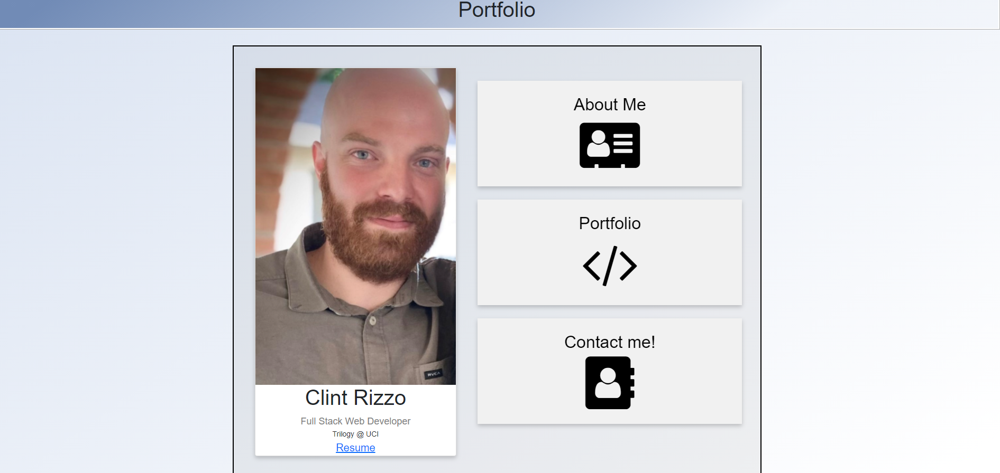
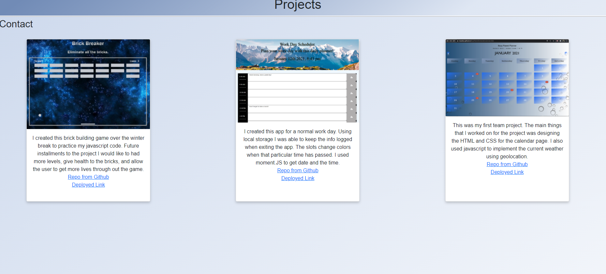

# hw2-portfolio

# languages used:
    1. HTML 
    2. CSS

# project:
1. About Me page features:
   1. I built this project to showcase my projects and give possible future employeers a quick synopsis of who I am and what i've been doing to become more career ready. The page technically has four links. If the user clicks on my name it will direct them back to the about me page. The 'about me', 'portfolio', and 'contact' are all linked in the navbar as well.
   2. All nav bars on the page were created using bootstrap. I changed the links to match my html links.
   3. This site was tested on an iphone 5s using an emulator.
   4. If page is taken out of full screen and condensed the page responds to the appropriate size. I added photos, check out number 5 to see the images.
   
2. Portfolio page features:
   1. Technically this page is still under construction. My plan for this page is to add a screen shot of the project and link in on the images to the repositories from github. 
   
3. Contact page features:
   1. This page gave me the most headache. Mostly because when trying to the page to respon to the iphone 5s the contact sheets and images I added did not want to fit on the page and wanted to overlap. I added a media screen for that section on the style sheet and it ended up working out really great.
   2. The first feature of this page is that I added my linkedin page and github page. I linked both pages to the images that are in the first column. 
   3. The next feature I used bootstrap to set up the interactiveness for users to put their name, email, and a message. The submit button works and "submits" the information"
   
4. Style sheet:
   1. I divided the style sheet with comments showing where each html file is linked to the style sheet. 
   2. The navbar and footer I used the same styles for all html files. Those style sheets are at the top of the css with comments to signify where they start and end.
       
5. Images of the page responsiveness to a condensed screen:
    1. 
    2. 
    3. 
6. Link to the project:
   1. [portfolio](https://clintrizzo.github.io/hw2-portfolio/)

# Sources:
1. [navbar](https://getbootstrap.com/docs/5.0/components/navbar/)
2. [columns](https://getbootstrap.com/docs/5.0/layout/columns/)
3. [HTML](https://www.w3schools.com/html/html5_semantic_elements.asp)
4. [sticky-footer](https://css-tricks.com/couple-takes-sticky-footer/#:~:text=The%20purpose%20of%20a%20sticky,bottom%20of%20the%20browser%20window.)
5. [media-css](https://www.w3schools.com/cssref/css3_pr_mediaquery.asp)
6. [background-image](https://www.w3schools.com/cssref/pr_background-image.asp)
7. [phoneview](https://www.gyford.com/phil/writing/2010/07/06/web-page-iphone/)

# Validators:
1. [v-html](https://www.freeformatter.com/html-validator.html)
    - I used this validator to double check my HTML file. My contact file came up with the most errors of fifteen. Thirteen of which were from the bootstrap link I used to get the name bar, email bar, and message bar. It was a great resource to try and getting the html to look better and be more organized. 

2. [emulator](http://www.viewportemulator.com/devices/apple/iphone-5s/)
    - I used this emulator to test responsiveness on cell phones. I chose to use the Iphone 5s to test the responsiveness of my portfolio. I found a lot of challenges to it but when I was ablt to get it to work I was extremely happy. 

# Future entries for this page:
  -  I have a few things that I would later add to this page.
     -  First: I would like to get the contact page to function so I can receive messages from people
     -  Second: I am thinking to make this a single page with a sidebar to navigate to the different sections of the page
     -  Third: I am excited to add screenshots of my projects. I want to link the images to my github or to the website.
